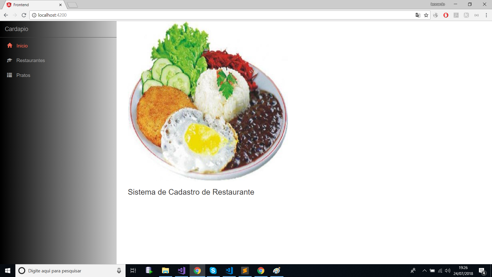
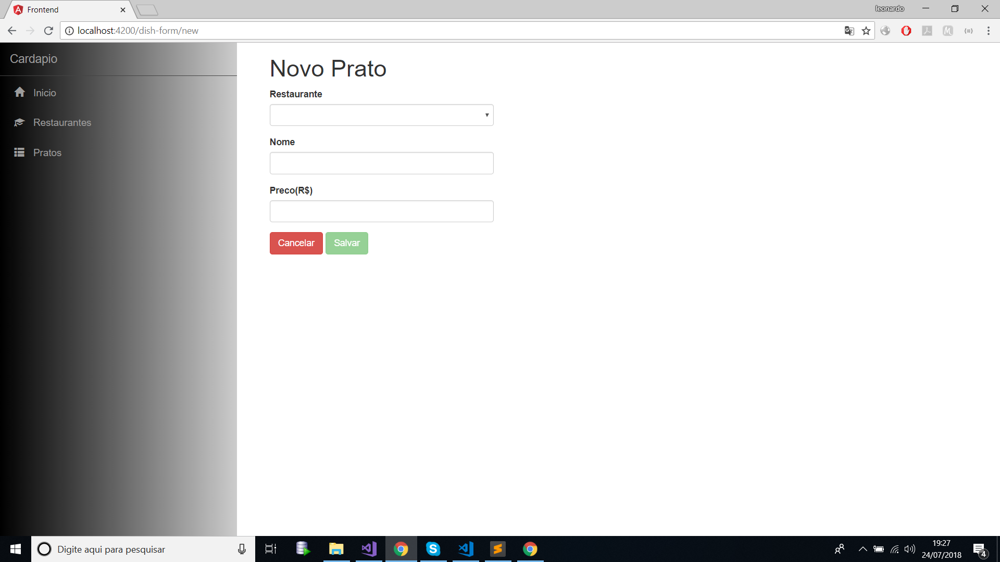
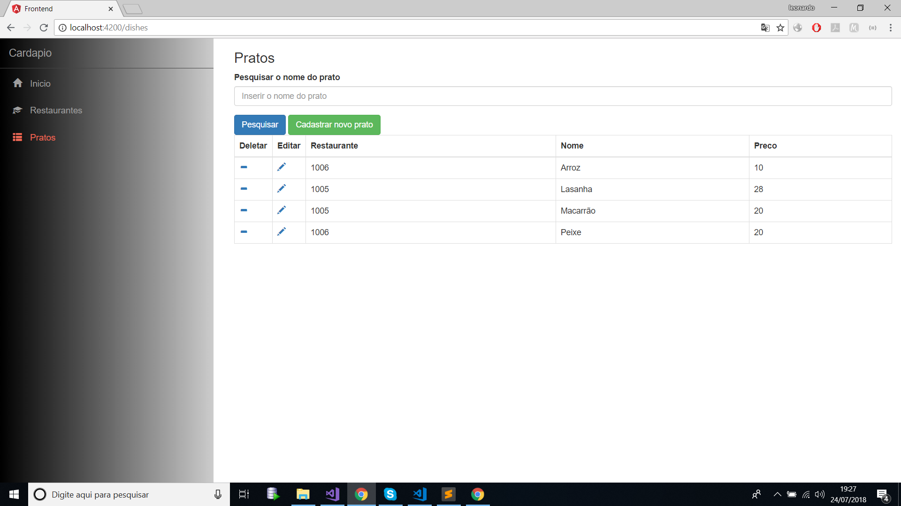
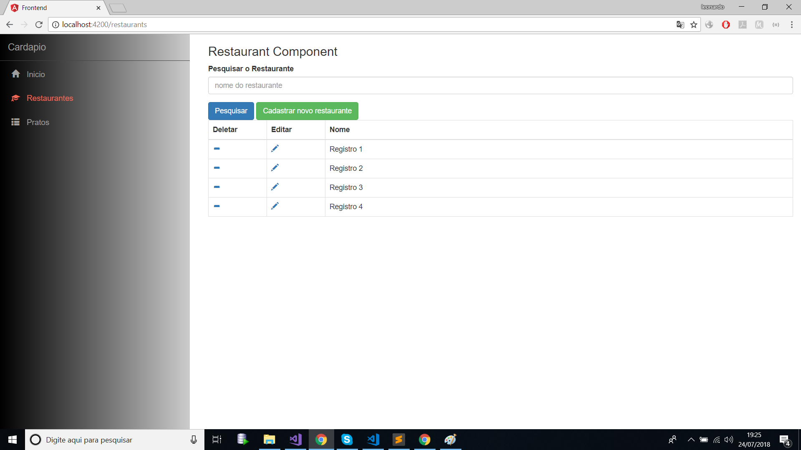
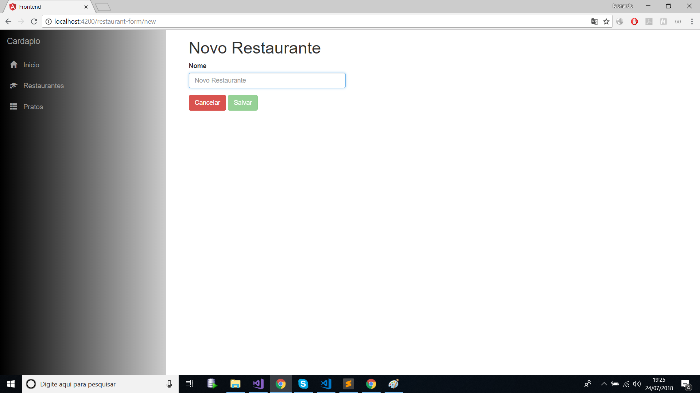

# frontend
Projeto sistema de restaurante v1.0.
Este projeto consistem em aplicar o CRUD sobre restaurantes e refeições.

## Imagens:
## Tela inicial:

## Tela dos pratos

## Tela de Adicionar ou editar dos pratos.

## Tela dos restaurantes

## Tela de Adicionar ou editar Restaurante.

